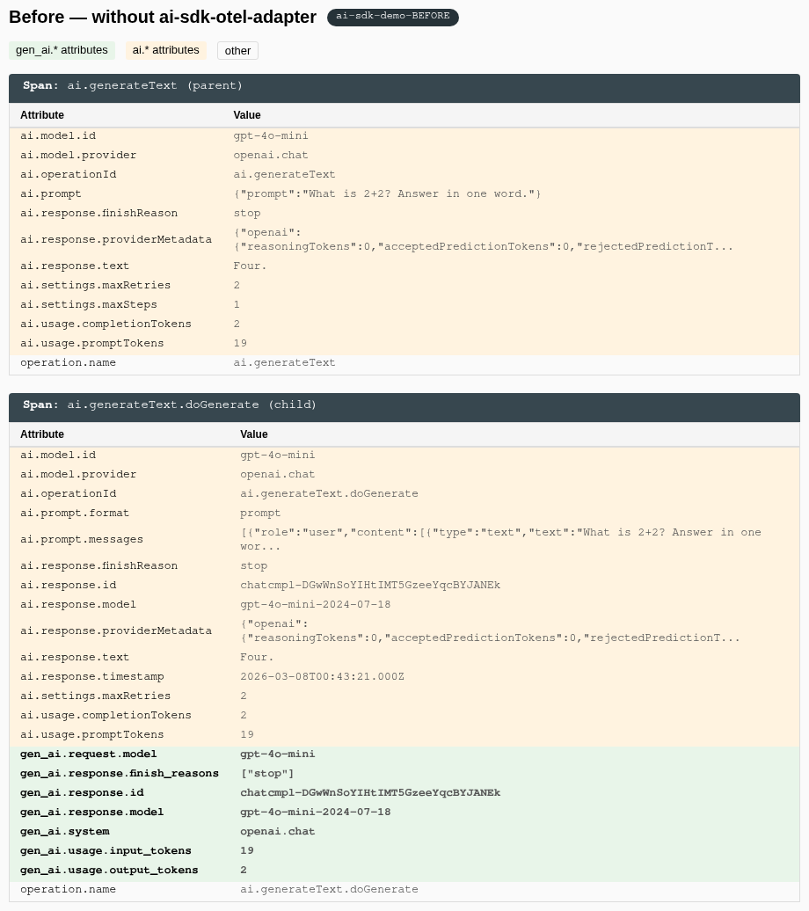
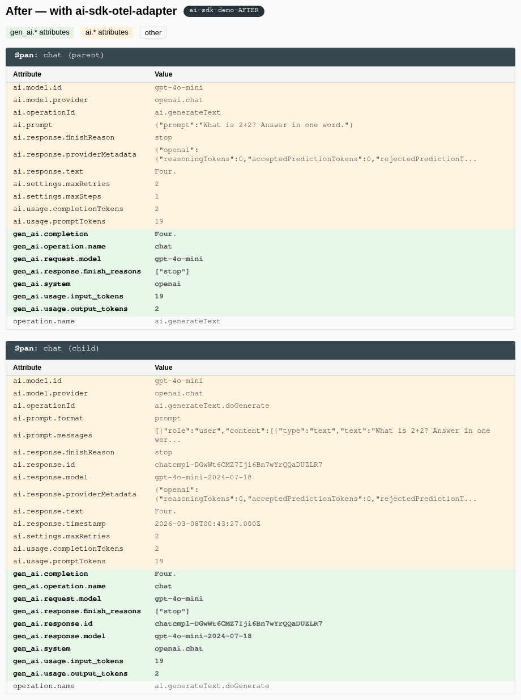

# ai-sdk-otel-adapter

[](https://www.npmjs.com/package/ai-sdk-otel-adapter)

Drop-in OTel SpanProcessor that fixes Vercel AI SDK spans for standard observability backends.

## The problem

The Vercel AI SDK instruments LLM calls with `ai.*` span attributes. The OpenTelemetry GenAI semantic conventions use `gen_ai.*`. Your Grafana GenAI dashboard panels, Datadog APM filters, and Jaeger trace views break silently — the telemetry data is there, but it's keyed wrong. Every observability vendor (Langfuse, Arize, LangSmith) ships their own proprietary SpanProcessor to paper over this. This package is the vendor-neutral alternative: one processor, every backend.

### Before (without adapter)

The parent `ai.generateText` span has zero `gen_ai.*` attributes. Standard observability dashboards can't read it.



### After (with adapter)

Span renamed to `chat`. Full `gen_ai.*` coverage: `gen_ai.system`, `gen_ai.completion`, `gen_ai.operation.name`, token counts — all the attributes standard backends expect.



## Quickstart

```bash
npm install ai-sdk-otel-adapter @opentelemetry/sdk-trace-base @opentelemetry/api
```

```typescript
import { NodeSDK } from '@opentelemetry/sdk-node';
import { GenAISpanProcessor } from 'ai-sdk-otel-adapter';
import { OTLPTraceExporter } from '@opentelemetry/exporter-trace-otlp-http';

const exporter = new OTLPTraceExporter();

const sdk = new NodeSDK({
  spanProcessors: [
    new GenAISpanProcessor({
      downstream: new SimpleSpanProcessor(exporter),
    }),
  ],
});

sdk.start();
```

That's it. Your AI SDK spans now carry standard `gen_ai.*` attributes that any OTel-compatible backend understands.

## Attribute mapping

| AI SDK attribute (`ai.*`) | GenAI convention (`gen_ai.*`) | Notes |
|---|---|---|
| `ai.model.id` | `gen_ai.request.model` | |
| `ai.model.provider` | `gen_ai.system` | Value normalized via provider map |
| `ai.response.model` | `gen_ai.response.model` | |
| `ai.response.id` | `gen_ai.response.id` | |
| `ai.usage.promptTokens` | `gen_ai.usage.input_tokens` | SDK uses `promptTokens` |
| `ai.usage.completionTokens` | `gen_ai.usage.output_tokens` | SDK uses `completionTokens` |
| `ai.usage.inputTokens` | `gen_ai.usage.input_tokens` | Alternate name |
| `ai.usage.outputTokens` | `gen_ai.usage.output_tokens` | Alternate name |
| `ai.usage.cachedInputTokens` | `gen_ai.usage.cache_read_input_tokens` | |
| `ai.usage.reasoningTokens` | `gen_ai.usage.reasoning_tokens` | |
| `ai.toolCall.name` | `gen_ai.tool.name` | Not emitted natively |
| `ai.toolCall.id` | `gen_ai.tool.call.id` | Not emitted natively |
| `ai.toolCall.args` | `gen_ai.tool.call.arguments` | Not emitted natively |
| `ai.response.finishReason` | `gen_ai.response.finish_reasons` | Scalar wrapped in array |
| `ai.response.text` | `gen_ai.completion` | |
| `ai.operationId` | `gen_ai.operation.name` | Value mapped via operation map |
| `ai.request.temperature` | `gen_ai.request.temperature` | |
| `ai.request.maxTokens` | `gen_ai.request.max_tokens` | |
| `ai.request.frequencyPenalty` | `gen_ai.request.frequency_penalty` | |
| `ai.request.presencePenalty` | `gen_ai.request.presence_penalty` | |
| `ai.request.topK` | `gen_ai.request.top_k` | |
| `ai.request.topP` | `gen_ai.request.top_p` | |
| `ai.request.stopSequences` | `gen_ai.request.stop_sequences` | |

Existing `gen_ai.*` attributes set natively by the SDK are never overwritten.

## Provider mapping

| `ai.model.provider` value | `gen_ai.system` output |
|---|---|
| `openai.*` | `openai` |
| `anthropic.*` | `anthropic` |
| `google.*` / `vertex.*` | `vertex_ai` |
| `mistral.*` | `mistral_ai` |
| `cohere.*` | `cohere` |
| `amazon-bedrock.*` | `aws_bedrock` |
| anything else | passed through as-is |

## Options

### `keepOriginal` (default: `true`)

Keep the original `ai.*` attributes alongside the new `gen_ai.*` ones. Set to `false` to strip them:

```typescript
new GenAISpanProcessor({ keepOriginal: false });
```

### `downstream`

Chain a downstream SpanProcessor. The processor mutates span attributes first, then forwards the span:

```typescript
import { BatchSpanProcessor } from '@opentelemetry/sdk-trace-base';

new GenAISpanProcessor({
  downstream: new BatchSpanProcessor(exporter),
});
```

`forceFlush()` and `shutdown()` calls propagate to the downstream processor automatically.

## Works with

Any OTel-compatible backend: **Grafana** (Tempo + Alloy), **Datadog**, **Jaeger**, **Honeycomb**, **Axiom**, **SigNoz**, **Uptrace**, **Elastic APM**, and anything else that speaks OTLP.

## Why this exists

The Vercel AI SDK emits telemetry in its own `ai.*` namespace. The OTel GenAI semantic conventions use `gen_ai.*`. The SDK covers _some_ `gen_ai.*` attributes natively, but leaves gaps — tool calls, operation names, cached/reasoning tokens, and more are only available as `ai.*`. See [vercel/ai#6673](https://github.com/vercel/ai/issues/6673) for the full discussion.

## Contributing

See [CONTRIBUTING.md](./CONTRIBUTING.md). The mapping lives in `src/mapping.ts` — adding a new attribute mapping is a one-line PR.

## License

MIT
